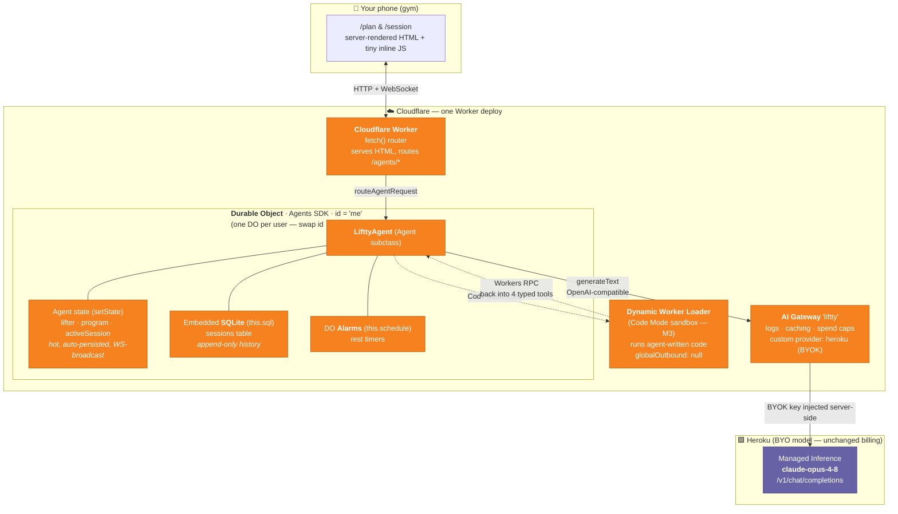
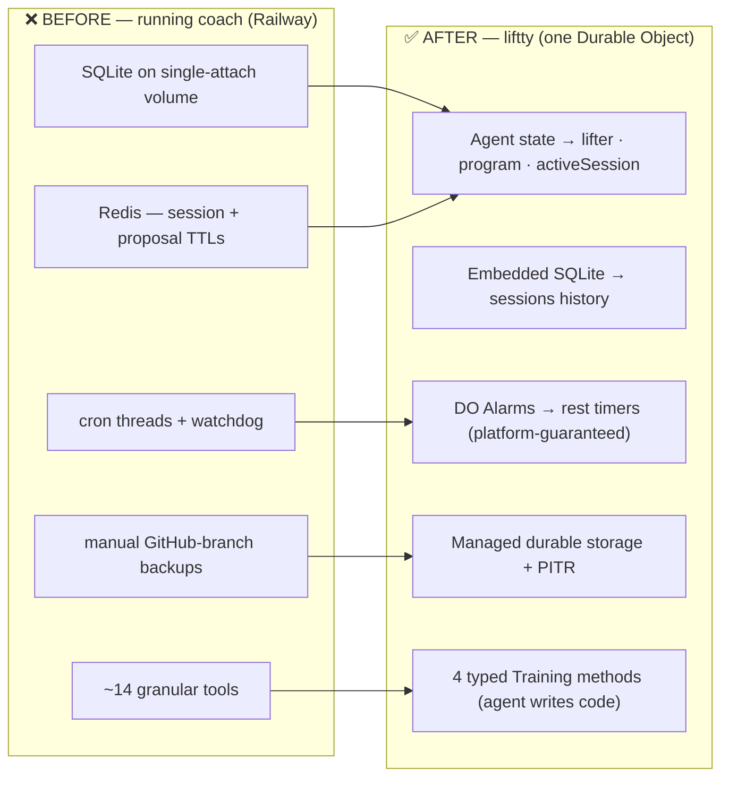
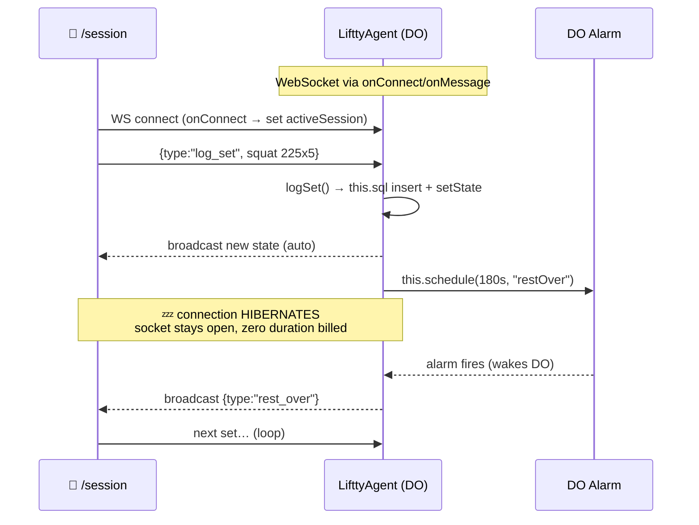
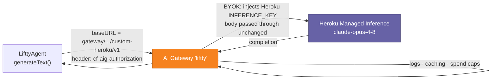
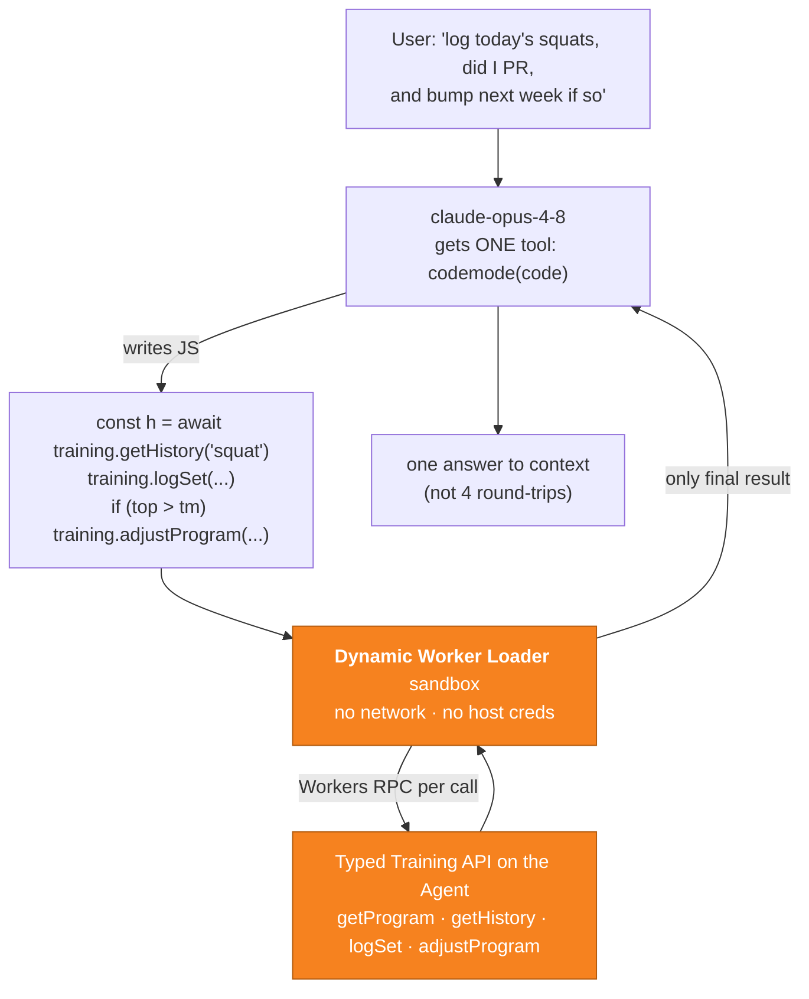

# liftty — Phased Build Plan (Workers + Durable Objects + Code Mode)

## Context

Re-platform a single-user weightlifting tracker into a **stateful coaching agent** on Cloudflare Workers for an interview demo. One `Agent` subclass = one Durable Object per user (id `"me"`, but routed by name so per-user isolation is real). Demonstrates: (a) per-user persistent agent state, (b) live workout session over WebSocket with hibernation + alarms, (c) **Code Mode** tool design — 4 typed methods the agent writes code against, not 14 wrapper tools. Deliberately contrasts the prior running-coach app (Flask/Railway, SQLite-on-volume, Redis, cron threads, ~14 tools).

**User constraints:** 1-day crunch. Only Heroku inference creds in hand — Workers Paid + AI Gateway still need provisioning. Frontend = server-rendered HTML, no framework. First commit = this plan as `PLAN.md` in the repo, then build.

**1-day strategy:** Guaranteed demo = Phases 0–4 (provision → M0 → M1 → M2 → M4). Code Mode (M3) is a **90-min hard timebox** in Phase 5 with the M2 fallback pre-wired — the typed-interface *doctrine* is demonstrated either way; only sandboxed execution is deferred. Friction log is written continuously, not at the end.

---

## Architecture diagrams & flows

> These are the interview whiteboard. Every box is labeled with the Cloudflare product doing the work. Mermaid renders in GitHub, VS Code, and most markdown viewers.

### 1. System architecture — what runs where



**One-line read:** the phone talks to **one Worker**; the Worker routes to **one Durable Object** (the agent) that owns its state, its SQLite, and its alarms; inference goes out through **AI Gateway** to Heroku; Code Mode runs generated code in the **Dynamic Worker Loader** sandbox and calls back via RPC.

### 2. State model — the "collapse" story (vs the running-coach app)



### 3. Live workout session — WebSocket + hibernation + alarm



**The point to say out loud:** the socket is open for the whole workout, but between sets the object hibernates — you only pay compute when a set actually lands or a timer fires. On Railway that was a thread sitting in a `while` loop.

### 4. Inference path — model is BYO, control plane is Cloudflare



**Deliberate tradeoff (say this):** Heroku stays the model so existing billing is untouched; AI Gateway is the Cloudflare-native control plane bolted in front — swappable provider boundary, logs, spend caps — without changing the model.

### 5. Code Mode — 4 typed tools, one code snippet (M3 centerpiece)



**Contrast line:** 14 wrapper tools + one call at a time → **1 typed interface the model writes code against**; a 3-step request is one snippet, and only the result re-enters context, not each intermediate tool call.

---

## Doc-drift findings (verified against live Cloudflare docs, 2026-07-06)

These correct the brief's `[DOCS]` placeholders — **interview gold: the brief was right to distrust training data.**

| Brief assumed | Current reality |
|---|---|
| Code Mode via `agents` package (`agents/codemode`) | **`@cloudflare/codemode`** standalone package; rewritten v0.1.0 (Feb 2026 changelog) — old `experimental_codemode()`/`CodeModeProxy` are gone. New API: `DynamicWorkerExecutor` + `createCodeTool()` from `@cloudflare/codemode/ai`. Still marked experimental. |
| Loader binding syntax unknown | `"worker_loaders": [{ "binding": "LOADER" }]` — top-level array in `wrangler.jsonc` |
| Dynamic Worker Loader beta opt-in maybe needed | **Open beta since ~Apr 2026, all Workers Paid accounts, no waitlist.** Pricing live since May 2026 (1,000 dynamic workers/mo included). `wrangler dev` supports the binding locally. |
| Agents-starter template | Now **Vite + React** (`agents/vite` plugin) — conflicts with server-rendered decision → scaffold minimal instead |
| `onStateUpdate` server hook | Renamed **`onStateChanged(state, source)`** (client `useAgent` still uses `onStateUpdate`) |
| BYOK = just store the key | BYOK keys live in Cloudflare Secrets Store; requests must send **`cf-aig-authorization`** (gateway auth token). So the Worker holds one secret either way — the gateway token instead of the Heroku key. |
| Prompt-caching drop through gateway (§10 risk) | Custom-provider routes are documented as pure URL-append proxying (body unchanged), so `cache_control` *likely* passes through; `/compat/` endpoint is the one that normalizes bodies. **Verify in gateway logs — friction-log item either way.** |

Other confirmed syntax: `this.sql` template tag (auto-parameterized); `this.schedule(seconds | Date | cron, "methodName", payload)` — alarms used under the hood, never touched directly; hibernation **automatic** (opt out via `static options = { hibernate: false }`); WebSockets survive hibernation, in-memory vars don't.

---

## Recommended simplifications vs the brief

1. **Skip the agents-starter template.** It's Vite+React now. Scaffold hello-world + `npm i agents`. Less to rip out, matches server-rendered frontend, and shows you know what the starter actually contains.
2. **Drop the `reviews` table from v1.** Only `sessions` is needed for every acceptance check. Coach critique lives in chat output. Add back only if time remains.
3. **Skip AI Gateway response caching.** Known sharp edge; *talking* about the caching caveat in the friction log is better interview material than a half-verified cache. (Do check whether `cache_control` reaches Heroku in gateway logs — 5 min, great friction-log entry.)
4. **Plain `Agent`, not `AIChatAgent`.** `@cloudflare/ai-chat` (the new home of the chat agent) is built around React hooks + streaming UI you won't use. Chat = one HTTP/WS handler + Vercel AI SDK `generateText` with an OpenAI-compatible provider pointed at the gateway.
5. **One agent class, everything in it.** No sub-agents, no queues, no email channels — the SDK has them all now; name-dropping that you *chose not to* use them is the flex.

---

## Values collected in Phase 0 (needed before code)

`CF_ACCOUNT_ID` · gateway id `liftty` · provider slug `heroku` · model `claude-opus-4-8` · AI Gateway auth token (→ Worker secret) · Heroku `INFERENCE_URL` region (`us` vs `eu`)

---

## Phases

### Phase 0 — Provision (you, in dashboards; ~30 min)

1. **Workers Paid:** dash.cloudflare.com → Workers & Pages → Plans → upgrade ($5/mo). Gates Dynamic Worker Loader only — Phases 1–4 would run on free, but do it now so Phase 5 isn't blocked.
2. **Heroku creds:** `heroku config -a <app> | grep INFERENCE` → note `INFERENCE_URL` (confirms `us` vs `eu`), `INFERENCE_KEY`, model `claude-opus-4-8`.
3. **AI Gateway:** dash → AI → AI Gateway → Create Gateway, name `liftty`. Copy `account_id` + gateway id from the endpoint shown. Enable **Authenticated Gateway** and create a gateway auth token (needed for BYOK).
4. **Custom provider:** in gateway `liftty` → Providers → Add custom provider — slug `heroku`, base_url `https://us.inference.heroku.com` (match step 2 region). Store `INFERENCE_KEY` via **BYOK** (Provider Keys → add with alias).
5. **Smoke-test the gateway from your laptop** before any code exists:
   ```sh
   curl https://gateway.ai.cloudflare.com/v1/<ACCOUNT_ID>/liftty/custom-heroku/v1/chat/completions \
     -H "cf-aig-authorization: Bearer <AIG_TOKEN>" \
     -H "Content-Type: application/json" \
     -d '{"model":"claude-opus-4-8","messages":[{"role":"user","content":"say hi"}]}'
   ```
   *Accept:* 200 + completion; request visible in AI Gateway logs. This de-risks the entire inference path before a single line of Worker code.
6. `wrangler login` (browser OAuth).

### Phase 1 — Scaffold + inference wiring (M0)

```sh
cd /Users/ethanlimchayseng/Documents/dev_folder/liftty
npm create cloudflare@latest . -- --type hello-world --lang ts --git --no-deploy
npm i agents ai @ai-sdk/openai-compatible zod
```

- Commit `PLAN.md` (this document, adapted) as the first artifact.
- `wrangler.jsonc`:
  ```jsonc
  {
    "$schema": "node_modules/wrangler/config-schema.json",
    "name": "liftty",
    "main": "src/server.ts",
    "compatibility_date": "2026-07-06",
    "compatibility_flags": ["nodejs_compat"],
    "durable_objects": { "bindings": [{ "name": "LifttyAgent", "class_name": "LifttyAgent" }] },
    "migrations": [{ "tag": "v1", "new_sqlite_classes": ["LifttyAgent"] }],
    "observability": { "enabled": true },
    "vars": { "CF_ACCOUNT_ID": "<id>", "AI_GATEWAY": "liftty", "MODEL": "claude-opus-4-8" }
  }
  ```
- `src/server.ts`: `LifttyAgent extends Agent<Env, State>`; Worker `fetch` = serve `/plan`, `/session`, else `routeAgentRequest(request, env)`.
- LLM client (`src/model.ts`): `createOpenAICompatible({ baseURL: "https://gateway.ai.cloudflare.com/v1/${env.CF_ACCOUNT_ID}/liftty/custom-heroku/v1", headers: { "cf-aig-authorization": \`Bearer ${env.AIG_TOKEN}\` } })`, model `claude-opus-4-8`.
- Chat endpoint on the agent (`onRequest` POST `/agents/liftty-agent/me/chat`) → `generateText` → response.
- ```sh
  wrangler types        # generate Env types
  wrangler dev          # local check
  wrangler secret put AIG_TOKEN
  wrangler deploy
  ```
- *Accept (M0):* deployed URL chat round-trips; request appears in AI Gateway logs. Check gateway log detail: does the request body reach Heroku unmodified? → friction log.

### Phase 2 — Agent state + `/plan` (M1)

- `initialState: State` on the class — `lifter` (PRs, training maxes, bodyweight, injuries), `program` (phase, goal, weekIndex, days), `activeSession: null`. Seed with your real 5/3/1-style numbers (demo realism).
- Create `sessions` table in the constructor/`onStart`: `` this.sql`CREATE TABLE IF NOT EXISTS sessions (id TEXT PRIMARY KEY, date TEXT, status TEXT, prescribed TEXT, actuals TEXT)` `` (JSON as TEXT; no `reviews` table per simplification #2).
- `/plan`: Worker route calls `getAgentByName(env.LifttyAgent, "me")` → RPC method returning state → render single HTML page, `<meta viewport>`, big type, today's session on top.
- `wrangler deploy` twice.
- *Accept (M1):* state survives redeploy (DO storage, not memory — the whole point vs Railway); `/plan` legible on your phone.

### Phase 3 — Typed `Training` tools, non-Code-Mode (M2)

- Define the 4-method interface exactly as the brief:
  `getProgram()` / `getHistory(exercise?, limit?)` / `logSet(set)` / `adjustProgram(change)` — implemented as methods on `LifttyAgent` against `this.state` + `this.sql`.
- Expose as 4 Vercel AI SDK tools (`tool({ description, inputSchema: z.object(...), execute })`) in the chat loop; `generateText({ ..., tools, stopWhen: stepCountIs(8) })` for multi-step.
- *Accept (M2):* "deload next week" mutates `program` (visible on `/plan` after refresh); "how's my squat trending" reads SQL history. **This is the demo baseline — commit and tag it (`git tag m2-baseline`) before touching Code Mode.**

### Phase 4 — Live session: WS + hibernation + alarms (M4)

- `onConnect(connection, ctx)` → mark `activeSession`; `onMessage` handles `{type:"log_set",...}` → `logSet()` → `this.setState` (auto-broadcasts to connected clients) → `this.schedule(restSeconds, "restOver", { exercise })`.
- `restOver(payload)` → `this.broadcast(JSON.stringify({type:"rest_over",...}))`.
- `/session`: server-rendered HTML + small inline `<script>` — raw `WebSocket` to `wss://<host>/agents/liftty-agent/me` (or `AgentClient` from `agents/client` if trivial). Set logger buttons + visible countdown.
- Hibernation is automatic — the *work* here is testing it: idle the phone mid-rest, watch `wrangler tail`, confirm the alarm still fires and the socket wakes. Note local-vs-prod differences → friction log.
- `wrangler deploy`.
- *Accept (M4):* phone: open `/session` → log set → timer fires → idle between sets without burning duration → next set wakes it.

### Phase 5 — Code Mode timebox: 90 min hard stop (M3)

```sh
npm i @cloudflare/codemode@latest
```
- `wrangler.jsonc`: add `"worker_loaders": [{ "binding": "LOADER" }]`.
- In the chat path: wrap the same 4 tools —
  ```ts
  import { DynamicWorkerExecutor } from "@cloudflare/codemode";
  import { createCodeTool } from "@cloudflare/codemode/ai";
  const executor = new DynamicWorkerExecutor({ loader: this.env.LOADER });
  const codemode = createCodeTool({ tools: trainingTools, executor });
  // generateText({ ..., tools: { codemode }, stopWhen: stepCountIs(5) })
  ```
  (Sandbox: capability-based, `globalOutbound: null` — no network; tool calls cross back via Workers RPC. Say exactly this sentence in the interview.)
- Test the money prompt: *"log today's squats: 5x225, 5x225, 8x225 — did I PR? if my top set beat my TM, bump next week's squat TM 5lb."*
- *Accept (M3):* one `codemode` tool call, one code snippet in logs, only the final result returns to context.
- **Fallback at minute 90:** `git checkout m2-baseline` chat path (keep a feature flag or branch), log exactly where the DX bit (bundling? RPC types? beta error message?) — that friction entry is as valuable as the working feature.

### Phase 6 — Polish + friction log (M5)

- `/session` and `/plan` visual pass (phone-first), favicon-level polish only.
- `FRICTION.md`: running log finalized — every `[DOCS]` drift found (Code Mode rewrite! starter template!), gateway `cache_control` verdict, hibernation local-dev notes, DO observability gaps vs `tail -f` on a Flask process.
- Final `wrangler deploy`; `wrangler tail` during a full phone run-through.
- *Accept (M5):* full loop (plan → session → sets → timer → coach chat → program change) works on your phone; friction log written.

---

## Interview framing (unchanged from brief — rehearse against the built thing)

"14 tools + SQLite-volume + Redis + cron threads + watchdog + manual backups → one Durable Object and a 4-method typed API the agent writes code against." Hand over the friction log. The doc-drift table above is a live example of why the brief said fetch docs at runtime — use it.

## Verification

- Each phase ends with `wrangler deploy` + its milestone acceptance check (phone where relevant).
- Phase 0 step 5 curl proves the inference path before any code.
- `wrangler tail` + AI Gateway logs are the two observability panes; wire both by end of Phase 1.
- `git tag m2-baseline` after Phase 3 is the demo safety net.
