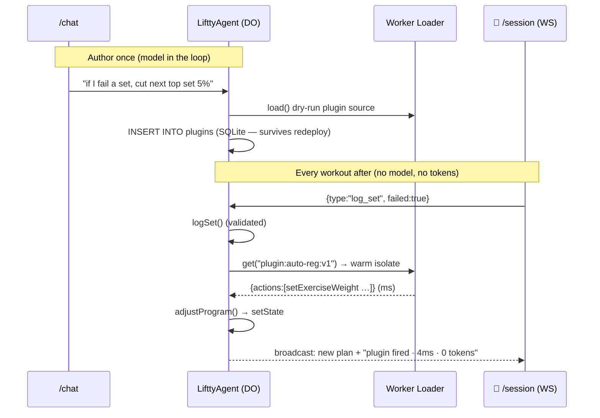

# Liftty Plugins — refined build plan v2 (interview project: agent → platform)

## Context

Ethan has a PM interview with the Cloudflare Workers runtime team (Rita Kozlov, VP Product Developer Platform & AI; Dan Lapid, eng lead on Workers runtime who co-authored Dynamic Workflows). The project extends the existing liftty repo to demonstrate technical depth on **dynamic code loading** and **isolates vs. containers**. Budget ~15–25 hrs.

## Platform state as of July 2026 (re-verify the week of the interview)

The gap claim below is date-stamped; this space is moving monthly. Current state:

- **Dynamic Workers** hit open beta March 24, 2026 (all paid Workers users). Raw API: `LOADER.load(code)` one-shot, `LOADER.get(id, callback)` cached — the callback runs only on cache miss and the docs' own canonical example loads code from *your own storage* inside that callback. Persistence being your problem is designed into the interface.
- Cloudflare has since shipped four point-solutions into the middle of the spectrum in ~3 months: `@cloudflare/codemode` + `@cloudflare/worker-bundler` + `@cloudflare/shell` (March, alongside the beta), **Durable Object Facets** (April 30 blog post), and `@cloudflare/dynamic-workflows` (May 1 changelog). Each solves one slice — execution, deps, files/data, per-code state, durability — none is a lifecycle product.
- **The April 30 Facets blog post publishes essentially our plugins pattern**: it opens with "what if you want an AI to generate more persistent code?" and answers with code stored in a DO's storage under a generated codeId, replayed into `LOADER.get()`, `globalOutbound: null`. This kills any "we invented the missing abstraction" framing — see the corrected thesis below.
- **Workers for Platforms**: unchanged. Deploy-time upload into dispatch namespaces; full lifecycle (storage, versioning, routing, observability, limits).

Action: before the interview, re-check `developers.cloudflare.com/changelog` for anything that further closes the middle. The memo says "as of July 2026" explicitly.

## The spectrum, precisely — which end ties to which product

This is the load-bearing mental model for both the demo and the memo. Three positions:

| | **Ephemeral runtime code** | **Persistent runtime-generated code** | **Deploy-time code** |
|---|---|---|---|
| Owned by | Dynamic Workers (`LOADER.load()`), Code Mode | **Nobody — this is the gap** | Workers for Platforms (dispatch namespaces) |
| Code authored | At runtime, by a model, per request | At runtime, by a model, **once** | At deploy time, by a developer/tenant pipeline |
| Code lifetime | One execution, then discarded | Stored, versioned, re-executed on events indefinitely | Full deployment lifecycle |
| Model in the loop | Every request (writes fresh code each time) | Authoring only; **never on the execution path** | Never |
| Lifecycle provided | None, by design | **Hand-rolled** (the Facets post is a recipe, not a product) | Storage, versioning, routing, observability, limits — all managed |
| Supporting shims | `@cloudflare/codemode` | `get()` isolate cache, DO Facets (per-code *state*), `@cloudflare/shell` (agent *data*), `@cloudflare/dynamic-workflows` (durability), `@cloudflare/worker-bundler` (deps) | Dispatch worker routing, outbound workers, tail workers |

What the middle makes you hand-roll — this list is both what M5 builds and the memo's backlog:

1. **Code storage / source of truth** (we use a `plugins` table in the DO's SQLite)
2. **Versioning + rollback** (we use versioned isolate ids `plugin:${id}:v${version}`)
3. **Pre-execution validation** (we dry-run via one-shot `load()` at authoring time)
4. **Per-code-unit observability** (we log `{plugin, ms, cold, actions}` JSON lines and render receipts)
5. **Quotas / blast-radius controls** (we cap actions, whitelist ops, restrict capabilities)
6. **Graduation path** — no story at all for promoting a hot plugin into a real deployed Worker with WfP's lifecycle

**Why not just upload plugins to WfP at runtime?** An interviewer will ask; the answer belongs in the memo, and the crisp version is: **WfP has the right lifecycle attached to the wrong ingestion model.** Three concrete reasons, in liftty terms:

1. **Wrong plane.** WfP upload is a call to Cloudflare's account-management API — the same control plane `wrangler deploy` uses. That means a deploy-scoped API token living inside an agent that executes model-written code (an agent holding credentials that can deploy account-wide), plus propagation delay before the script is callable. The DO-local pattern keeps the hot path entirely on the data plane: code goes into the DO's own SQLite and runs on the next event, no external authority involved. Rule of thumb the memo leans on: **the hot path should never depend on the management layer.**
2. **Wrong cardinality.** WfP's pricing, dashboard, and management model assume one meaningful script per *tenant*. Plugins are many trivial scripts per *user* — a real product has millions of ~30-line policies. Making each a full deployed Worker is registering a company for every sticky note; the ~$0.002/day isolate economics exist precisely because Dynamic Workers carry no per-script management overhead.
3. **Split trust domain.** Today authoring, storage, and execution live in one Durable Object. Runtime WfP upload scatters them across a dispatch namespace, the DO, and a dispatch Worker — three moving parts where there was one.

The honest asymmetry, stated for the memo: the middle is closer to Dynamic Workers in *ingestion* (runtime, data-plane, per-user scale) but closer to WfP in *lifecycle needs* (versioning, observability, limits). The gap product is WfP's lifecycle grafted onto Dynamic Workers' ingestion — and the graduation path (promote a hot plugin into a real WfP Worker) is the natural bridge between the two ends, not a hack.

## Code Mode vs. plugins — the lifetime distinction (say this exactly)

The two use the same primitive and are easy to conflate. The difference is **lifetime, not capability**:

- **Code Mode**: the model is invoked on *every request*, writes fresh code every time, the code executes once via `load()` and is discarded. What it optimizes is the cost *of each inference* — one code block orchestrating five API calls instead of five tool-call round trips, intermediates never entering the context window. **The model is still in the hot path**, just cheaper per pass.
- **Plugins**: the model is invoked *once*, at authoring. The source is stored, and every subsequent event executes it via `get()` with zero inference. **The model moves from the hot path to the authoring path.**

One-liner for the demo: **"Code Mode makes the model's decisions cheaper; plugins make already-made decisions free."** Systems framing if the room wants it: Code Mode is a REPL — write a script, run it, throw it away. Plugins are saving that script and wiring it to a trigger. Same primitive (`load()` vs `get()` + stored source), different lifetime — and the persistence is precisely what forces all the lifecycle machinery in the table above.

Two properties make this more than caching, and both land with a runtime audience: the code is **checkable before it runs** (dry-run, action whitelist, capability restriction — you can't lint a cached LLM output) and **deterministic and auditable after** (same event → same actions, loggable diff). Tightest analogy: interpreter vs. JIT — LLM inference for novel inputs, compiled policy for repeated ones.

## The thesis, stated precisely (two layers — don't conflate them)

**The primary problem (what the demo solves):** an LLM call is the wrong tool for a decision that's already been made. Once the lifter states a policy in chat ("if I fail a set, cut my next top set 5% and add a back-off set"), re-running the model on every logged set to re-derive that policy costs 2–5 seconds and real tokens — unusable mid-workout. Hard-coding it in app code is fast but not user-customizable. The answer is the empty middle of the spectrum: **the agent authors the policy as code once (model in the loop), then the runtime executes it deterministically forever (no model in the loop)** — personalized *and* <10ms, ~free. Isolates are what make this economically viable per-user (ms startup, ~$0.002/unique-worker/day, no concurrency caps); containers can't do this per-tenant at that price. That's the runtime story for the room.

**The secondary observation (what the memo captures — REVISED):** the middle of the spectrum is currently a **blog-post recipe, not a product**. Cloudflare's own Facets post publishes the hand-rolled pattern; four libraries in three months keep shimming individual slices; nobody owns the lifecycle. The memo's claim is: **agents create demand for persistent runtime-generated code, Cloudflare demonstrably feels the pull (its own shipping cadence is the evidence), and every team building agents will re-write the same ~200 lines of lifecycle glue until one of the two products claims the middle.** We built the glue end-to-end; the six-item list above is the backlog for whichever product should own it.

**The strategic reframe of that backlog:** the gap isn't a missing convenience — it's the **adoption blocker for the correct agent architecture**. Production agents today burn inference re-deriving decisions that were already made; the fix (model authors code once, runtime executes it forever) only becomes the *default* architecture when persistent agent-authored code is a managed platform feature. As long as it's a 200-line hand-rolled pattern, only teams like Zite do it. When it's a platform feature, it's how every agent is built — and Cloudflare is the one platform structurally incentivized to build it, because Cloudflare sells compute, not tokens: every decision moved out of the model lands on Workers.

The demo argues layer one; the memo argues layer two. Lead with layer one.

## Demo framing — three misstatements to avoid (from dry-run review)

1. **Never say "Facets solved this."** Facets give a dynamic worker its own DOs with isolated SQLite — per-plugin *state*, not code lifecycle. The Facets *post* published the hand-rolled pattern. Saying facets solved it concedes the gap away. Correct line: "Cloudflare published the pattern in the Facets post; I built it end-to-end, and the glue it makes you hand-roll is the backlog."
2. **The plugin fires on an application event, not when "the agent chooses the tool."** After authoring, the agent chooses nothing. The lifter taps log-set on `/session`, the WS message hits the DO, `logSet` runs, the DO dispatches the event to the plugin isolate. No LLM call, no context window, anywhere on that path. Phrasing: "the model authors the policy once in chat; from then on the runtime enforces it on every event, and the model is never invoked again."
3. **The parser never involves the LLM either, and (in v1) the agent didn't write it.** Neither workload touches the model at execution time — that's not what distinguishes them. The isolate-vs-container split is purely **runtime requirements**: the policy is pure JS logic → V8 isolate (ms, ~free); the `.fit` parser needs a full Python environment and binary-parsing libs → container (seconds of cold start, real cost). Same trust architecture (pure function in, validated DO path for all writes), different runtime, measured contrast. The parser is hand-written against a real COROS fixture; agent-authored parser regeneration is a stretch goal, not a claim.

**30-second demo script:** "Cloudflare has two ends of a spectrum — code loaded at runtime that evaporates, and code uploaded at deploy time with a full lifecycle. Agents create demand for the middle: code a model writes at runtime that has to persist and keep running. Cloudflare's own Facets post publishes this as a hand-rolled pattern; I built it for real — the coach compiles a training policy into a stored, versioned, dry-run-validated module that fires on every logged set in ~4ms with zero tokens — and the lifecycle glue I had to write myself is the product backlog. As a contrast, the same app runs one workload that can't live in an isolate — a Python `.fit` parser in a container — with measured cold-start numbers for both."

**The memo-level compressed thesis (the strategy version, for when the room zooms out):** "Most production agent spend is inference re-deriving decisions that were already made. The fix is agents compiling their own recurring behavior into code — model as compiler, not interpreter. That cuts cost-to-serve by orders of magnitude, collapses latency, and makes agent behavior deterministic and auditable. It only becomes the default architecture when persistent agent-authored code is a managed platform feature instead of a hand-rolled pattern — and Cloudflare is the one platform structurally incentivized to build it, because every decision that leaves the model lands on Workers. I built the pattern end-to-end to find out exactly what that feature needs to be."

**Two pushbacks to prep:**
- *"Isn't this just 'write code'?"* — Yes; the novelty is **who** writes it (a model, at runtime, from natural language, per user) and the **cardinality** (millions of per-user variants no deploy pipeline can serve; only runtime loading on isolates makes it economical).
- *"Why not just cache the LLM output?"* — A cached output can't be dry-run validated, capability-restricted, versioned, or composed; code can. The lifecycle machinery isn't overhead on the idea — it *is* the idea.

**Two closing beats the demo should land (after the golden flow):**
- **The side-by-side.** Show `src/plugins.ts` next to the imagined two-call `MODULES` API (the M5 mapping table / `PRODUCT-VISION.md`): "these 200 lines are what every agent team will re-write until this is a binding." The compression ratio *is* the product argument — let the room see it rather than hear it.
- **The graduation line.** "Code born in the middle should be able to retire on the right" — a hot plugin promoted into a real WfP Worker with the full lifecycle. One sentence; it stitches the whole spectrum together and hands the room a roadmap thought they can react to.

## Target strategy — the why behind every stack choice

Each of these should be sayable on demand; together they're the depth check.

| Choice | Why |
|---|---|
| Raw `LOADER` binding, not `@cloudflare/codemode` SDK (M5) | Hands-on-depth story (M3 already used the SDK — showing both is the arc); and `get()`'s cache-miss callback gives a *truthful* cold/warm signal for `RUNTIME-NOTES.md` |
| DO SQLite as the code registry | Authoring, storage, and execution live in one object and one trust domain; survives redeploy; per-user DB means per-user plugin cardinality is free; no external control plane in the hot path (contrast with runtime WfP upload, above) |
| Isolate id `plugin:${id}:v${version}` | Version bump = deterministic cache invalidation; hand-rolled versioning made visible — memo exhibit #2 |
| Author-time dry-run via one-shot `load()` | Compile/shape check before insert; `load()` (uncached) is the correct primitive for a throwaway validation run; memo exhibit #3 and a demo beat |
| Harness module + `ProgramChange[]` contract | Plain-object exports aren't RPC-callable (harness class is); plugin returns proposed changes, never mutates — all writes go through the already-validated `adjustProgram` path; no `logSet` capability = no recursion |
| `globalOutbound: null` + `limits: {cpuMs: 50, subRequests: 0}` + action cap + op whitelist | Deny-by-default blast radius; a buggy or malicious plugin can at worst propose ≤3 whitelisted changes; a throwing plugin is recorded and skipped, never breaks `logSet` |
| Container for the `.fit` parser | Python + binary FIT libs cannot run in a V8 isolate; the workload forces the other runtime, which is what makes the measured isolate-vs-container contrast honest rather than staged |
| Isolate economics as the enabler | ms startup, MB memory, ~$0.002/unique-worker/day, no global sandbox-count limits — per-user policy cardinality is viable on isolates and absurd on containers; this is why the middle of the spectrum only became a real product question when this primitive shipped |

## Terminology: "plugins" is OUR coined name, not a Cloudflare concept

There is no plugins feature in the Agents SDK or anywhere in the Workers platform. What we're building is: a table of model-authored JS modules stored inside the agent's Durable Object, executed on demand via the **Worker Loader** binding — the same primitive Code Mode uses, held onto across conversations instead of thrown away, following the pattern Cloudflare published in the Facets post. We name it "plugins" because that's the product it wants to be; "user-defined training rules" is the honest description. Say this explicitly in the interview — **building the published pattern end-to-end and articulating its productization backlog is the demonstration** (not inventing it; see framing correction #1).

## The SQLite story (one sentence, since it reads confusingly)

Durable Objects **are** the source of truth — each DO ships with its own embedded SQLite database, accessed as `this.sql` from inside the object. "DO SQLite" isn't a second datastore; it's the DO's native storage engine. Liftty already uses it for the `sessions` history table; the new `plugins` table is just a second table in the same per-user database. (The Agents SDK's `setState` state also persists into that same embedded storage under the hood — hot state and SQL tables are two views over one durable store owned by one object.)

## Repo reality check (verified against the working tree — corrections to the draft)

1. **M0–M3 are merged and live in prod** (`main`, version `f4ad7e36`, Workers Paid). M4 (live WS session) is specced in `PLAN.md` Phase 4 but not started. All consistent with the draft.
2. **There is uncommitted work on `main`**: a token-measurement study harness (~570 lines modified across `src/server.ts`, `src/training.ts` (20 decoy tools), `src/model.ts` (`cf-aig-metadata` run tagging, `stream_options.include_usage`), `src/codemode.ts`, `package.json`, `.gitignore`). This is the raw material for the draft's `TOKEN-OPTIMIZATION.md` — **which does not exist yet**. The draft cites it as done; it isn't.
3. **`package.json` references `scripts/spike-metadata.mts` and `scripts/measure.mts` that are absent from this clone.** They presumably exist untracked on the local machine. They must be committed (or the script entries removed) before the study is reproducible. Flag to Ethan if implementing remotely.
4. **`FRICTION.md` does not exist** — the 8-item friction log lives in `PLAN.md` (lines 32–40) and is slated for extraction in M5.
5. **`fit_python_script` is not in this repo** — it's from the prior running-coach project and is run-oriented. The M6 parser is written fresh against a real COROS strength-session `.fit` fixture (see M6 step 0); the old script is reference only.
6. **Naming collision:** the uncommitted comments in `src/server.ts` call the token study the "M4 harness," but `PLAN.md` defines M4 = live session. Fix the comments when committing (call it "token study"), and use the milestone numbering below.
7. **Raw Worker Loader API confirmed in generated types** (`worker-configuration.d.ts:3476`): `LOADER.get(name, getCode)` (cached, callback runs only on miss) and `LOADER.load(code)` (one-shot); `WorkerLoaderWorkerCode` supports `globalOutbound: null`, `limits: { cpuMs, subRequests }`, multi-module `modules`, and `env`. M3 used the `@cloudflare/codemode` SDK wrapper; plugins use the **raw binding** — see the why table.

## Milestones

| # | Name | Est. | Branch |
|---|---|---|---|
| TS | Land the token study (commit + `TOKEN-OPTIMIZATION.md`) | 2–3 h | `token-study` |
| M4 | Minimal live session (WS + hibernation) — the demo stage | 3–4 h | `m4-live-session` |
| M5 | **Liftty Plugins** — persistent model-authored code (core) | 8–10 h | `m5-plugins` |
| M6 | Container contrast — `.fit` parser in a Sandbox/Container | 4–5 h (cuttable) | `m6-fit-container` |
| M7 | Docs: `RUNTIME-NOTES.md`, `FRICTION.md`, the Loaders-vs-WfP memo | 3 h | with M5/M6 PRs or own branch |

Each milestone: branch → build → `/review` → PR → merge (matches the repo's established workflow).

### TS — land the in-flight token study first (blocks everything)

The uncommitted harness touches the same files M4/M5 will edit (`server.ts`, `training.ts`). Do not build on a dirty tree.

- Commit the working-tree changes on branch `token-study`. Rename the "M4 harness" comments to "token study." Recover `scripts/spike-metadata.mts` + `scripts/measure.mts` from the local machine (or, if unrecoverable, remove the `spike`/`measure` script entries and note it).
- If measurement runs already produced data (gitignored `results/`), write `TOKEN-OPTIMIZATION.md`: method (run tagging via `cf-aig-metadata`, variants `parallel-nudge`/`parallel-strong`/`one-snippet`, decoy-tool scaling 0→20, synthetic history scaling via `/reseed?sessions=N`), results table, and the comparison to Rita's 81% Code Mode claim. If runs haven't happened, running them needs prod creds — hand that step to Ethan and write the doc skeleton.
- Note in the doc: this study measures the **left end of the spectrum** (Code Mode's per-inference savings). M5 then measures the middle (zero inference per event). The two numbers together are the "cheaper vs. free" contrast.

### M4 — minimal live session (the golden demo's stage)

Follow `PLAN.md` Phase 4 spec exactly; skip polish. All on `LifttyAgent` in `src/server.ts`:

- `onConnect(connection, ctx)` → ensure `activeSession` exists (reuse the day-picking logic from `logSet`/`todayIndex`).
- `onMessage(connection, message)` → parse `{type:"log_set", exercise, reps, weight, failed?}` → `this.logSet(...)` (already validated) → `this.schedule(restSeconds, "restOver", { exercise })`. `setState` already auto-broadcasts state to connected clients.
- `restOver(payload)` → `this.broadcast(JSON.stringify({type:"rest_over", ...}))`.
- New `src/views/session.ts` (mirror the structure/aesthetic of `src/views/chat.ts`): raw `WebSocket` to `wss://<host>/agents/liftty-agent/me` (the `routeAgentRequest` fallthrough in `server.ts:588` already routes it), set-logger buttons per prescribed lift, visible rest countdown, and a receipts strip (used by M5).
- Route `/session` in the default `fetch` alongside `/plan` and `/chat`.
- Verify hooks are still named `onConnect`/`onMessage` in `agents@0.17.x` at build time (doc drift is a repo theme — two renames caught in M3).
- Extend `test/index.spec.ts`: `/session` serves 200 and contains expected markup.

### M5 — Liftty Plugins (core)

**Design constraint that governs this whole milestone: build the hand-rolled version so it visibly mirrors the productized API it's arguing for.** The demo's strongest artifact is a side-by-side — ~200 lines of M5 glue next to the two-call `MODULES` API they'd collapse into (see `PRODUCT-VISION.md`). That only works if the seams line up 1:1, so structure `src/plugins.ts` around exactly two public functions and comment each with the future call it prototypes:

| Hand-rolled (M5 builds this) | Productized (what the memo argues for) |
|---|---|
| `createPlugin({name, source})` — dry-run via `load()`, shape-check, `INSERT INTO plugins` | `env.MODULES.put(name, source, {contract, validate, capabilities})` |
| `runPlugins(agent, event)` — `SELECT` enabled rows, `LOADER.get()` with versioned id + harness, try/catch, bookkeeping, JSON log line | `env.MODULES.get(name).onSetLogged(event)` |
| `plugins` SQLite table | managed platform-side source storage |
| `plugin:${id}:v${version}` isolate ids + version column | automatic version history / rollback |
| `HARNESS_SRC` wrapper + manual shape check | declared, enforced `contract` |
| `globalOutbound: null` + `limits` passed per call | `capabilities` manifest declared once at `put` |
| `last_run`/`last_result` columns + `console.log` JSON lines | per-module tail + dashboard analytics |

Don't refactor beyond this — the point is legibility of the mapping, not abstraction. A short comment block at the top of `src/plugins.ts` reproducing this table earns its keep in the code review an interviewer might actually read.

**Storage** — new table in `onStart()` (`src/server.ts:354`), same pattern as `sessions`:

```sql
CREATE TABLE IF NOT EXISTS plugins (
  id TEXT PRIMARY KEY, name TEXT NOT NULL, source TEXT NOT NULL,
  version INTEGER NOT NULL DEFAULT 1, enabled INTEGER NOT NULL DEFAULT 1,
  created_at TEXT NOT NULL, last_run TEXT, last_result TEXT
)
```

This table is memo exhibit #1: the code registry the platform doesn't provide.

**Plugin contract (v1: data in, actions out).** The model authors ONLY a pure-logic module:

```js
// plugin.js — what the coach writes
export default {
  // event: { set, failed, prescribed, program, recentHistory, activeSession }
  onSetLogged(event) {
    return { actions: [/* ProgramChange[] */], note?: string };
  }
}
```

The plugin never touches state directly: it returns `ProgramChange[]` (the existing discriminated union in `src/training.ts:38`) and the DO applies them through the already-validated `adjustProgram` path. This is the tightest blast-radius story — no `logSet` capability means no recursion; a buggy plugin can at worst propose changes, and it's capped (max 3 actions per event, applied ops whitelisted to `deload`/`setExerciseWeight`). Live capability RPC back into the DO (what `DynamicWorkerExecutor` does) is the stretch, not v1.

**Runner** — new `src/plugins.ts`:

- A fixed trusted `HARNESS_SRC` module: imports `WorkerEntrypoint` from `cloudflare:workers`, imports `./plugin.js`, exports an entrypoint class with `onSetLogged(event)` delegating to the plugin (plain-object exports aren't RPC-callable; the harness class is).
- `runPlugins(agent, event)`: for each enabled row —
  ```ts
  let cold = false;
  const stub = env.LOADER.get(`plugin:${row.id}:v${row.version}`, () => {
    cold = true;
    return { compatibilityDate: "2026-03-10", mainModule: "harness.js",
             modules: { "harness.js": HARNESS_SRC, "plugin.js": row.source },
             globalOutbound: null, limits: { cpuMs: 50, subRequests: 0 } };
  });
  const t0 = Date.now();
  const result = await stub.getEntrypoint().onSetLogged(event); // awaited RPC = I/O, so Date.now() advances
  const ms = Date.now() - t0;
  ```
  The stable id `plugin:${id}:v${version}` means version bumps invalidate the isolate cache and `cold` is a truthful warm/cold signal (callback only runs on miss).
- Each plugin wrapped in try/catch: a throwing plugin records the error in `last_result` and is skipped — it can never break `logSet`. Apply returned actions via `agent.adjustProgram`, update `last_run`/`last_result`, `console.log` a JSON line `{plugin, ms, cold, actions}` (feeds `wrangler tail` → `RUNTIME-NOTES.md`).
- Hook: call `runPlugins` from the M4 `onMessage` `log_set` path (and optionally from `logSet` itself), then broadcast `{type:"plugin_fired", name, ms, cold, changed}` so `/session` renders the receipt: "auto-regulate fired · 4 ms · 0 tokens." **The dispatch site is the framing-correction-#2 proof: the trigger is the WS event, not an agent tool choice.**

**Authoring** — three new typed methods on `LifttyAgent` + tools in `buildTrainingTools` (hand-written `jsonSchema()`, never zod — the `$schema` lesson):

- `createPlugin({name, source})` — **dry-run first**: `LOADER.load(...)` (one-shot, uncached) against a synthetic event; reject on throw/bad shape. Then insert. Author-time compile check is both good engineering and a demo beat.
- `listPlugins()`, `setPluginEnabled({id, enabled})`.
- These flow into Code Mode automatically via `buildCodeModeTool` (`src/codemode.ts:43` wraps `buildTrainingTools`) — the coach can author plugins from a snippet. This is the spectrum's left end feeding the middle: the model uses ephemeral code (Code Mode) to author persistent code (a plugin) — one sentence worth saying in the demo.
- Extend the system prompt (`CODEMODE_HINT` area in `server.ts`) with the plugin contract: the `event` shape, the `ProgramChange` union, "return actions, don't mutate."
- Show plugin source in `/chat` (reuse the existing `addCode` snippet renderer in `src/views/chat.ts:107`) and list active plugins on `/plan`.

**Golden demo flow this enables:**



### M6 — container contrast: `.fit` parsing (cuttable if over budget)

One workload that genuinely can't live in an isolate: binary `.fit` parsing needs a full Python environment. **Its role in the demo is workload placement — isolate vs. container chosen per-workload in one app — not agent authorship (framing correction #3).** The parser is hand-written; the model is not involved at execution time in either workload. **The source device is Ethan's COROS watch, and the data is a strength session, not run data.** FIT is an open Garmin-defined standard that COROS exports natively (via the COROS app), and Python FIT SDKs (`garmin-fit-sdk`, `fitparse`) read any conformant file — but COROS strength sessions have their own field quirks (rep counts are auto-detected; per-set weight may be absent or user-entered, muscle-group tags vary).

- **Step 0 — inspect before designing (do this first, ~30 min):** Ethan exports a real COROS strength-workout `.fit`, commit it as a test fixture (`fit-parser/fixtures/`), and dump its messages with the SDK to see which set/rep/weight fields actually exist. The parser's mapping to `SetInput[]` is designed from that dump, not from Garmin assumptions. If weight turns out to be missing from COROS files, the parser emits sets with reps only (`logSet` already treats weight as optional) and matches weights from the prescribed program day — note the design call in `FRICTION.md`.
- New `fit-parser/` dir: `Dockerfile` (python slim + the FIT SDK) + minimal HTTP server (`POST /parse` bytes → strength-set JSON). The old running-coach repo's `fit_python_script` is run-oriented — treat it as reference for FIT handling only; the strength-set extraction is written fresh against the COROS fixture.
- `wrangler.jsonc`: `containers` config + a `FitParser extends Container` class (from `@cloudflare/containers`, DO-backed, needs a migration entry).
- Worker route `POST /upload-fit`: forward bytes to the container → parsed sets → `getAgentByName(env.LifttyAgent, "me")` → insert a completed `sessions` row + `logSet` loop through the same typed methods. The container is a pure function; all writes stay on the validated DO path — same trust design as plugins.
- Measure container cold-start vs. isolate spin-up — the headline number for the memo, and the empirical grounding for the "why isolates make per-user policy cardinality viable" argument.
- Requires Docker locally and container-enabled deploys; if the environment can't build, deliver code + Dockerfile with a documented deploy step for Ethan.

### M7 — the PM artifacts

- **`RUNTIME-NOTES.md`** — measured table from prod `wrangler tail` (not `wrangler dev`; M3 taught that dev hides prod gating): cold `load()` vs cached `get()` latency, warm-hit rate for repeated `get(id)`, snippet-size vs startup, RPC hop overhead, DO wake latency, container cold start. Note the timing caveat honestly: Workers freezes `Date.now()` during CPU work, so all numbers are wall-time across awaited I/O boundaries — exactly the depth-check detail a runtime eng lead will probe.
- **`FRICTION.md`** — extract the 8 items from `PLAN.md:32-40`, add new ones from M4–M6 (hibernation local-vs-prod, raw Loader DX vs the codemode SDK, container dev loop).
- **`LOADERS-VS-WFP.md`** — the gap memo, restructured around the revised claim. **Lead with the strategic why, not the gap** — the gap only matters because of what it blocks. Required sections:
  0. **Opening — the strategic argument chain (in this order):**
     (a) *The waste is structural:* production agents re-derive already-made decisions on every invocation — paying inference prices (slowest, most expensive, least deterministic compute primitive) to re-execute decisions that haven't changed. This scales with usage, not value, and is the line item that kills agent unit economics in production.
     (b) *The fix is compilation, model as compiler:* the model handles novel inputs (authoring path — natural language → policy as code); deterministic runtime handles repeated inputs (hot path). Not "less AI" — inference where it's differentiated, code where it's cheap.
     (c) *Three payoffs, not two:* cost-to-serve (metered LLM call → share of ~$0.002/day warm isolate), latency (2–5s → ~4ms, three orders of magnitude), and **determinism** — same event, same action, auditable diff. The third is what production agents need for compliance, debugging, and trust; cached LLM output gives none of the three, code gives all three.
     (d) *The adoption blocker:* this only becomes the default agent architecture when persistent agent-authored code is a managed platform feature. As a 200-line hand-rolled pattern, only Zite-class teams do it; as a platform feature, it's how every agent gets built. The backlog isn't a convenience list — it's what's blocking the correct architecture from being the default one.
     (e) *Why Cloudflare specifically:* Cloudflare sells compute, not tokens. Every decision moved from the model to an isolate shifts spend away from model providers and onto Workers — model-provider platforms are structurally conflicted about removing inference from the hot path; Cloudflare is structurally the beneficiary. Owning the middle makes Cloudflare the default compile target for the agent economy, a position that strengthens with agent traffic regardless of which model wins.
     (f) *Liftty is the existence proof:* one app, both paths measured — token study (left end, cheaper inference), plugins (middle, zero inference), container contrast (pattern spans runtimes). The receipt strip — "plugin fired · 4ms · 0 tokens" — is the thesis in one UI element.
  1. **The spectrum table** (from this plan) — ephemeral / persistent-runtime-generated / deploy-time, with product ownership per column.
  2. **The claim, falsifiable and date-stamped:** as of July 2026, for code generated at runtime that must persist and re-execute, no Cloudflare product provides managed code storage, versioning/rollback, pre-execution validation, per-code-unit observability, or a graduation path.
  3. **Evidence:** (a) *API design* — `get()`'s canonical example fetches code from "your own storage"; persistence-as-your-problem is in the interface; (b) *shipping behavior* — codemode, bundler, shell, Facets, dynamic-workflows: four shims into the middle in ~3 months, each a slice, none a lifecycle product; the Facets post literally publishes the hand-rolled pattern; (c) *demand at scale* — Zite running millions of daily dynamic-worker executions for chat-built apps; (d) *our build* — the six hand-rolled items, with file/line references into liftty.
  4. **Why not runtime WfP upload** — the "right lifecycle, wrong ingestion model" section from this plan (wrong plane / wrong cardinality / split trust domain), closing with the graduation-path bridge.
  5. **Differentiation from `@cloudflare/shell`** — shell persists the agent's *files/data*; plugins persist *versioned executable policy with a typed contract*. A runtime eng lead will probe this line; have it ready.
  6. **The counterargument, addressed:** Cloudflare's philosophy is composable primitives + libraries. Rebuttal: Durable Objects and the Agents SDK are both precedents of hand-rolled-pattern → product; the memo argues the middle has crossed the same threshold. Cite Dan's Dynamic Workflows as the strongest internal evidence of the pull.
  7. **The backlog** for whichever product claims the middle: managed `LOADER.put(id, source)` with version history + rollback, per-id tail/analytics, validation hooks (contract declaration + mandatory dry-run), declarative capability manifests + auto-disable on error rate, quotas/billing attribution, event/trigger binding (subscribe modules to DO events, cron), optional human-approval gates for enterprise, and a promotion path into WfP (`wrangler modules promote`). One paragraph on where it lives: primitive in Dynamic Workers (the registry API), DX surface in the Agents SDK (agent-native tools for authoring/managing modules) — matching Cloudflare's established primitive→SDK productization pattern. One sentence on the authoring shift: when the agent is the author, the lifecycle API's primary consumer is the model itself — schemas must be tool-callable, validation errors structured for model self-correction (AX alongside DX).
  8. **Adjacent gap categories** (pick 2–3, not all): per-user policy/automation rules (this project), agent skill libraries (an agent that improves by writing itself reusable functions — the plugins table generalized), per-tenant SaaS business logic (dynamic-workflows' own named use case). These cover consumer, agent-infra, and enterprise respectively.
- **`PRODUCT-VISION.md`** — the golden-end-state document (separate from the gap memo, which argues the *problem*; this sketches the *solution*): the imagined `MODULES` API annotated in liftty terms, the hand-rolled → productized mapping table, the full feature set, placement (Dynamic Workers primitive + Agents SDK DX), the marketing positioning, and the AX observation. Lives in the repo root next to the memo; the M5 mapping table references it. Written — commit alongside M5 or M7.
- Update `README.md` status table + `PLAN.md` progress log per milestone (established repo habit).

**Stretch only if time remains:** per-plugin DO Facets for isolated plugin state (and note in the memo that Facets solve state, not lifecycle); live capability RPC into the DO from the plugin isolate; **agent-authored parser regeneration** (the model writes/updates the `.fit` field mapping from a message dump — upgrades M6 from workload-placement contrast to a second authored-code case); trying Dan's Dynamic Workflows library for the rest-timer flow and writing real feedback on it.

## What this arms Ethan to argue (revised)

Ephemeral + persistent dynamic loading shipped hands-on (M3 SDK wrapper *and* raw `LOADER.get` — both ends of the model-involvement spectrum); isolates-vs-containers chosen per-workload in one app with measured numbers; token economics independently replicated (TS study) *and then made irrelevant on the hot path* (M5's 0-token receipts — cheaper vs. free); the collapse narrative extends — "the interesting product wasn't the agent, it was the runtime that runs code my model wrote"; and a memo that validates Cloudflare's own direction (Facets post, Dynamic Workflows) while articulating the productization backlog only someone who built the pattern end-to-end can write.

## Verification

- **Per milestone:** `npm test` (extend `test/index.spec.ts`); `wrangler dev` locally — vitest-pool-workers + dev support the `worker_loaders` binding, so plugin create/run paths are unit-testable: (a) plugin persists and fires after DO restart, (b) a plugin calling `fetch` fails (`globalOutbound: null`) and is recorded in `last_result` without breaking `logSet`, (c) dry-run rejects a syntax-error plugin, (d) action cap and op whitelist enforced.
- **Prod (needs Ethan's account/phone):** deploy; on `/session` log a failed set → plan updates instantly with the receipt strip showing ms/0-tokens; redeploy → plugin still fires; `wrangler tail` numbers land in `RUNTIME-NOTES.md`; `.fit` upload from the watch lands in session history end-to-end.
- **Narrative dry-run:** 5-minute walkthrough — collapse story → spectrum → Code Mode (cheaper) → plugins golden demo (free) → container contrast → memo. Rehearse the three framing corrections and the 30-second script; the Facets misstatement in particular must not survive rehearsal.
- **Week-of check:** re-read the Cloudflare changelog for anything that moves the middle; adjust the memo's date-stamped claim if needed.
- Remember M3's lesson: nothing counts as verified until it's confirmed **deployed**, not just in `wrangler dev`.
